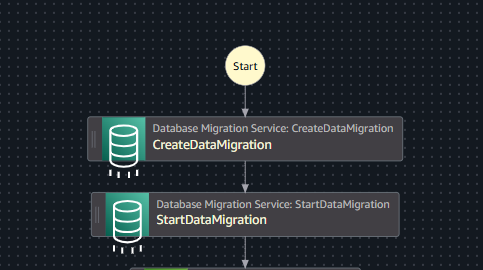
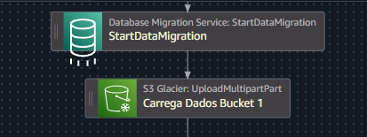

# ✅ Segundo Desafio - Criando um Fluxo no AWS Step Funcions

Criaremos abaixo a resolução do desafio 2 do Bootcamp Santander Code Girls 2025. Nesse exemplo usarei um caso de uso do Step Functions
para ETL de Dados.
---

## 🎯 Modelo AWS Step Functions ETL + S3 + Atena 

---

## 🎲 Descrição detalhada do Fluxo: 

---

1️⃣ Criaremos o setup de migração dos dados usando o Database Migration Service.

2️⃣ Iniciamos a migração dos dados com Database Migration Service.

3️⃣ Enviamos os dados carregados para um Bucket S3 pré criado, os dados neste Bucket ainda não foram tratados.

4️⃣ Faremos a integração do AWS Step Functions com Atena para criação da pipeline ETL.

5️⃣ Carregamos os dados tratados em outro Bucket S3 pré criado , neste Bucket sempre serão armazenados somente os dados tratados.

## 💭 Resumo Geral do Fluxo

✔ AWS Database Migration Service -> Criação e inicio da migração de Dados.\
✔ S3 (Dados) -> Carregamento de Dados migrados sem tratamento.\
✔ Atena -> Criação de pipeline ETL (tratamento dos dados).\
✔ S3 (Dados) -> Carregamento de Dados Tratados.\

---
